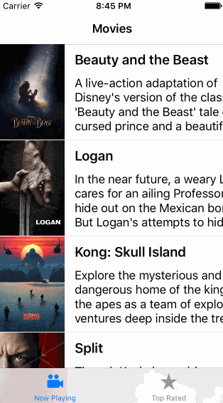

# Flicks - Assignment 1

Displays movie posters from [TheMovieDB.org][tmdb].

Submitted by: Alan Hamlett

Time spent: [14 hrs 51 mins][time spent coding]

## User Stories

The following **required** functionality is complete:

* [X] User can view a list of movies currently playing in theaters from [The Movie Database][tmdb]. Poster images must be loaded asynchronously.
* [X] User can view movie details by tapping on a cell.
* [X] User sees loading state while waiting for movies API. You can use one of the 3rd party libraries listed on CocoaControls.
* [X] User sees an error message when there's a networking error. You may not use UIAlertController or a 3rd party library to display the error. See [this screenshot][error msg] for what the error message should look like.
* [X] User can pull to refresh the movie list.
* [X] Add a tab bar for Now Playing or Top Rated movies.

The following **optional** features are implemented:
* [ ] Implement a UISegmentedControl to switch between a list view and a grid view.
* [ ] Add a search bar.
* [ ] All images fade in as they are loading.
* [ ] For the large poster, load the low-res image first and switch to high-res when complete.
* [ ] Customize the highlight and selection effect of the cell.
* [ ] Customize the navigation bar.
* [ ] Tapping on a movie poster image shows the movie poster as full screen and zoomable.
* [ ] User can tap on a button to play the movie trailer.

## Video Walkthrough

Here's a walkthrough of implemented user stories:

GIF created with [LiceCap](http://www.cockos.com/licecap/).

## Notes

Challenges encountered while building the app:

* Most of my time was spent trying to display the error message in a fixed
  `UIView` on network errors. It was very hard to get the error view to display
  over the `UITableView`.

## License

    Copyright 2017 Alan Hamlett

    Licensed under the Apache License, Version 2.0 (the "License");
    you may not use this file except in compliance with the License.
    You may obtain a copy of the License at

        http://www.apache.org/licenses/LICENSE-2.0

    Unless required by applicable law or agreed to in writing, software
    distributed under the License is distributed on an "AS IS" BASIS,
    WITHOUT WARRANTIES OR CONDITIONS OF ANY KIND, either express or implied.
    See the License for the specific language governing permissions and
    limitations under the License.

[time spent coding]: https://wakatime.com/@alan/projects/xmwcivswel?start=2017-03-26&end=2017-03-27(https://developers.themoviedb.org/3)
[tmdb]: https://developers.themoviedb.org/3
[error msg]: http://forums.androidcentral.com/attachments/google-nexus-10-tablet/51236d1355614625t-facebook-network-error-no-internet-connection-screenshot_2012-12-15-15-15-05.png
